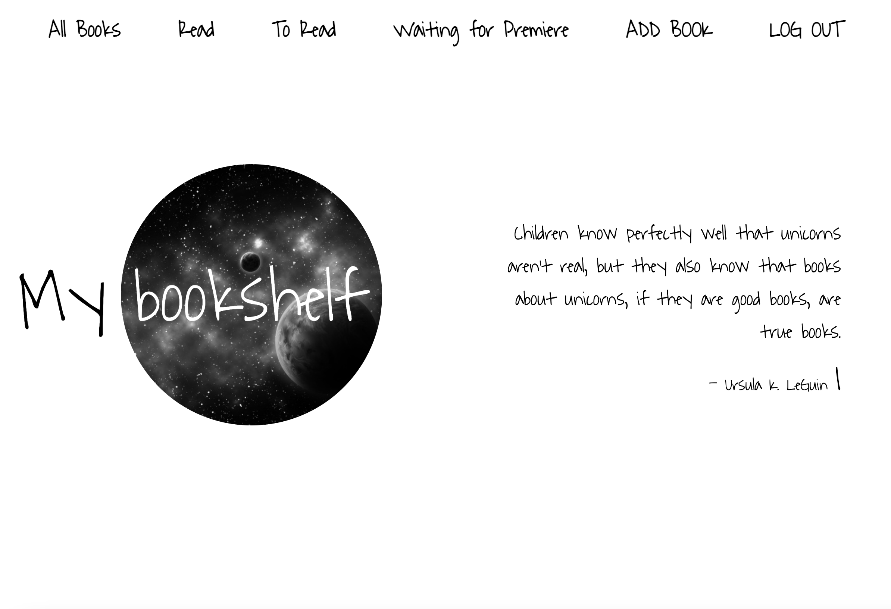
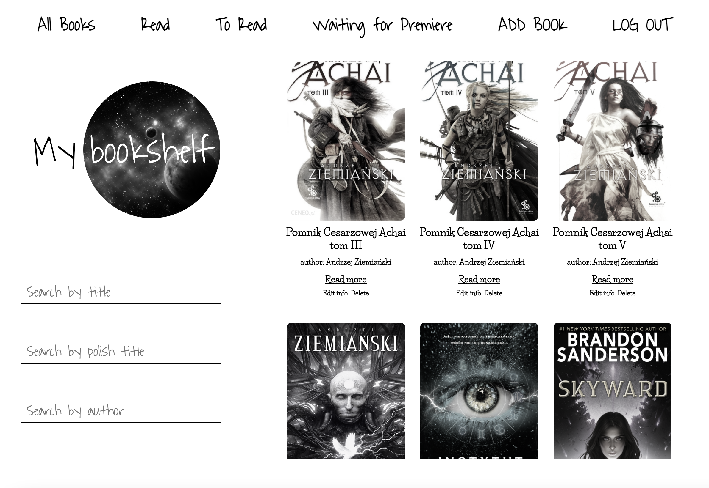
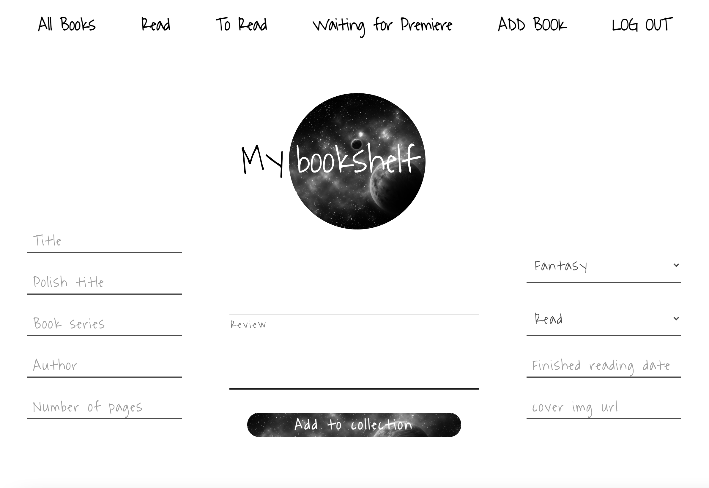

# Give Away for those in need!

> **Concept**: Your private online library. You can sort books according to their status, progress and other variables. Be creative, write your own description and provide the cover you like the most. Everything is modifiable. Create your own library!


## 🌍 Accessibility

```Check it online:``` https://hostingtest-d385f.web.app

Login for the test account:

login: ```konradgauza@gmail.com```
hasło: ```test123```
### 🏠 Home page

### 📚 List of your books

### 📝 Add new book



## 💥 Application

- Register new account and login easily
- Display your books in smart component
- Add new book
- Edit your book data in real time
- Delete book in real time
- Personalize the cover and book data
- Find books by author, title, polish title in real time
- Display book cover and description in responsive pop-up

## 👌 Functions
* Responsive Web Design (RWD)
* All books are saved Cloud Firestore database

## 📓 Used Technologies:

- Create React App
- React
- React Router
- React Hooks
- React Hamburger menu
- React Typist
- Sweetalert
- Controlled forms
- Node Sass
- Firebase Auth
- Firebase Cloud Firestore
- Firebase Hosting
- Firebase API


## ⚙️ How to install:
1. ``` git clone https://github.com/konradgauza/MyBookshelf.git ```
2. ``` cd MyBookshelf ```
3. ``` npm i ```
4. ``` npm start ```
